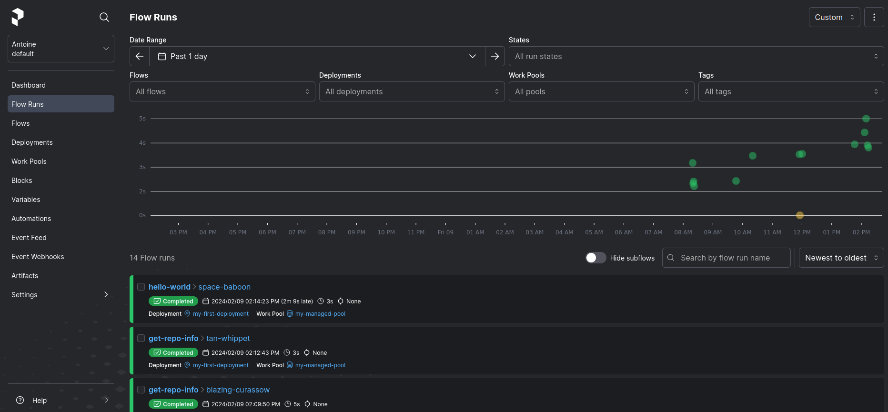
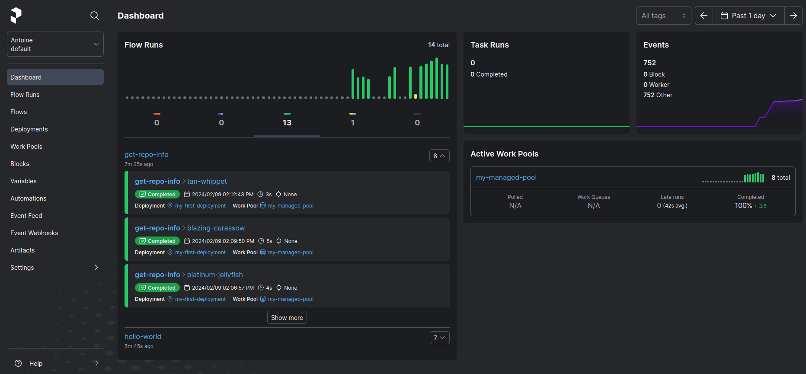
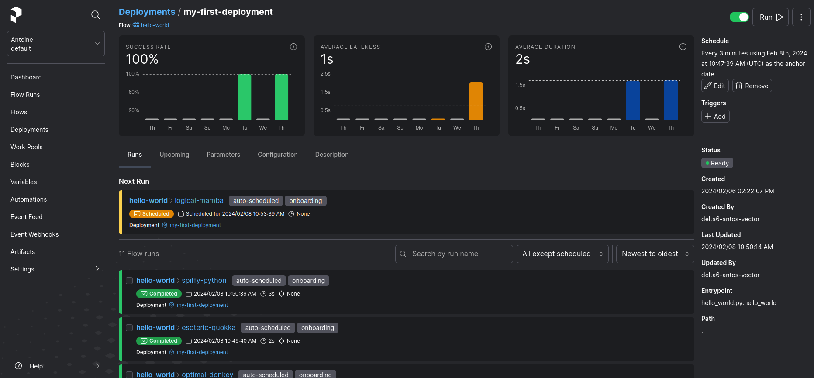
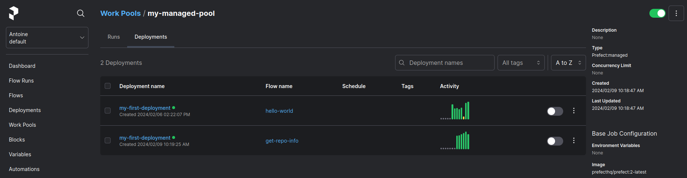

# Prefect: description

Prefect est un outil d'orchestration de workflow pour construire, observer et réagir aux pipelines de données.

Il permet de transformer n'importe quel fonction python en une unité de travail qui peut être observé et orchestré, à l'aide de décorateurs.

(Il utilise son API.)

# Avantages

## Planification (Schedules)

Il permet d'automatiser la création de nouveaux fleaux d'exécution pour les déploiements. (Schedules utilise l'API)

## Automatisations

Possibilité de configurer des actions (github actions) que Prefect exécutera automatiquement en se basant sur les  événements (event-basis triggering)

## Gestion des workflow

Il permet de gérer des flows multiple simultanées.

## Dashboard

Il permet d'avoir un dashboard montrant les informations des flows d'exécutions.

## Déploiement

### Local

On peut déployer Prefect sur notre machine.

Il donne un contrôle total sur l'environnement d'exécution, mais nous devenons responsable de la maintenance du support.

### Distant

Possibilité d'utiliser des services cloud comme AWS, Azure et même Prefect Cloud.

### Docker

Possibilité de mettre des workflow dans des conteneurs Docker pour les déployer facilement sur les plateforme prenant en charge Docker.

## Work-pool

Les "work-pools" sont des groupes de tâches pouvant être exécutées en parallèle. 

Les "work-pools" et les "workers" servent de lien entre l'environnement d'orchestration de Prefect et l'environnement d'exécution. Lorsqu'un déploiement déclenche l'exécution d'un flux, celui-ci est assigné à un "work pool" spécifique pour la planification. 

Un "worker" opérant dans l'environnement d'exécution peut alors interroger son "work pool" désigné pour rechercher de nouveaux flux à exécuter.